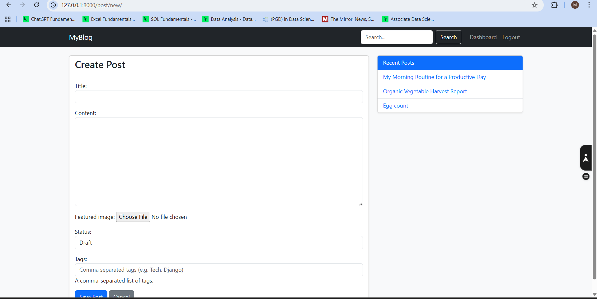
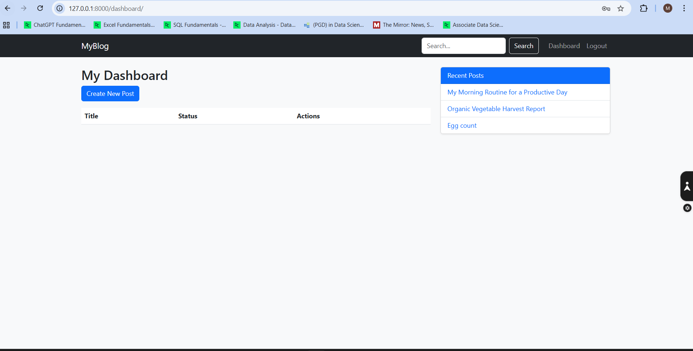

This is my Django blog project.

## Features
- Create new post
- Dashboard
- Delete post
- Edit post

## Screenshots
## Screenshots

Create post Page:  

Dashboard Page:  

Home Page:  

Login Page:  

Delete post:  

Post edit Page:  

Register Page:  

<!-- Updated Screenshots -->
